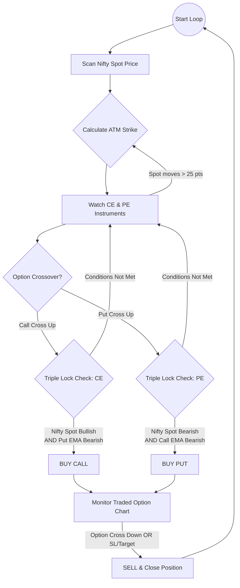

### 1. The Triple-Lock State Machine Diagram

Copy the code block below. If your AI tool supports Mermaid, it will visualize this perfectly.

---

### 2. Comprehensive Strategy Specification

## **Module: Triple-Lock TradeFlow Logic**

### **A. Objective**

Synchronize three independent data streams to filter out noise and capture high-velocity momentum. Entry is based on the Option chart; Confirmation is based on the Spot and Inverse Option.

### **B. Data Requirements**

| Instrument | Role | Required Indicators |
| --- | --- | --- |
| **Nifty Spot** | Trend Anchor | EMA (Fast), EMA (Slow) |
| **ATM Call (CE)** | Execution/Trigger | EMA (Fast), EMA (Slow) |
| **ATM Put (PE)** | Inverse Filter | EMA (Fast), EMA (Slow) |

### **C. The State Machine Logic**

#### **Step 1: The Selection State**

* Triggered at every **Candle Close**.
* Calculate `ATM_Strike = round(Nifty_Spot / 50) * 50`.
* Maintain a `Selection_Price`. If `abs(Nifty_Spot - Selection_Price) > 25`, re-run selection.

#### **Step 2: The Signal State**

* **CALL Buy Signal:** If `CE_EMA_Fast` crosses above `CE_EMA_Slow`.
* **PUT Buy Signal:** If `PE_EMA_Fast` crosses above `PE_EMA_Slow`.

#### **Step 3: The Confirmation State (The Triple Lock)**

If a **CALL Buy Signal** occurs, verify:

1. `Nifty_Spot_EMA_Fast > Nifty_Spot_EMA_Slow` (Market is Bullish).
2. `PE_EMA_Fast < PE_EMA_Slow` (Put is actually decaying/dropping).
*All three must be true in the same/sequential candle window to trigger `PositionManager.execute()`.*

#### **Step 4: The Exit State**

* Once a trade is live, ignore Nifty Spot and the Inverse Option.
* Monitor **only** the active Option's chart.
* **Trigger Exit:** If `Active_Option_EMA_Fast` crosses below `Active_Option_EMA_Slow`.

