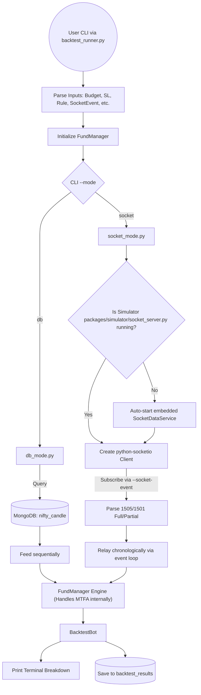

# Trade Bot V2 Testing & Backtest Guide

This document outlines the testing framework, workflows, and usage instructions for Trade Bot V2. We use `pytest` as our primary testing framework for both unit and integration tests.

---

## 1. Testing Framework

We utilize `pytest` for all Python tests in this project. All tests are located in the root `tests/` directory.

### Running Tests

You can run tests from the project root using the following commands:

#### Run All Tests
```bash
pytest tests/
```

#### Run a Specific Test File
```bash
pytest tests/test_fund_manager.py
```

#### Run a Specific Test Case
```bash
pytest tests/test_fund_manager.py::TestFundManager::test_orchestration
```

#### Run Tests with Output
```bash
pytest -v tests/
```

Individual tests will now log the database they are using (e.g., `tradebot_test` or `tradebot_frozen_test`).

---

### 2. Database Namespacing & Global Safety

To prevent data pollution and ensure deterministic results, we use multiple test databases. **By default, the testing environment (via `conftest.py`) redirects all database operations to `tradebot_test` to protect your development data.**

- **`tradebot`**: Used for manual development and live testing. **Never used by automated tests.**
- **`tradebot_frozen_test`**: Used for **deterministic** integration tests (E2E strategies). This DB is seeded with static historical data.
- **`tradebot_test`**: **Global Default** for all unit and volatile tests. It acts as a scratchpad for tests that write data.

Isolation is handled automatically. If you create a new test, it will safely use `tradebot_test` without any extra configuration.

### Seeding the Frozen Database
Before running E2E tests, ensure the frozen data is seeded:
```bash
python3 scripts/seed_test_data.py
```

---

## 2. Integration Tests (Backtesting)

The backtest engine is a vital parts of our integration testing, ensuring strategy logic works identically to the live system.

### Backtest Workflow

The backtest engine runs in two modes: **DB Mode** (High Speed) and **Socket Mode** (High Fidelity). In both modes, the final receiver and evaluator of the data is the `FundManager`.



---

## 3. Component Roles & Responsibilities

1. **`packages/backtest/backtest_runner.py`**: The CLI entry point for integration tests.
2. **`packages/backtest/db_mode.py`**: The High-Speed testing feeder. Best for rapid iteration.
3. **`packages/backtest/socket_mode.py`**: The High-Fidelity testing feeder. Best for exact live-simulation testing.
4. **`packages/backtest/backtest_base.py` (`BacktestBot`)**: Receives and logs simulated `PaperTrades`.
5. **`packages/tradeflow/fund_manager.py`**: The MTFA execution orchestrator, core of our trading logic.
6. **`packages/simulator/socket_server.py`**: Market data emulator for Socket Mode.

---

## 4. Execution Commands for Backtesting

### Fast DB Mode
```bash
python -m packages.backtest.backtest_runner \
    --mode db \
    --start 2026-02-02 \
    --end 2026-02-02 \
    --rule-id triple-lock-momentum \
    --budget 200000 \
    --sl 10.0 \
    --target-steps "5,15,25"
```

### High-Fidelity Socket Mode
```bash
python -m packages.backtest.backtest_runner \
    --mode socket \
    --socket-event 1505-json-full \
    --start 2026-02-02 \
    --end 2026-02-02 \
    --rule-id scalp-ema-rsi-1 \
    --instrument-type OPTIONS \
    --option-type ATM \
    --budget 200000 \
    --sl 20.0 \
    --target-steps "5,15,30" \
    --trailing-sl 5.0
```

**Parameters Reference:**
- See `python -m packages.backtest.backtest_runner --help` for full parameter list.
