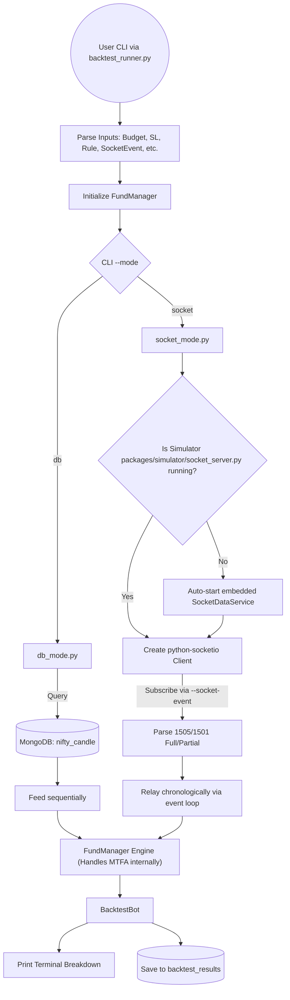

# Trade Bot V2 Testing & Backtest Guide

This document outlines the testing framework, workflows, and usage instructions for Trade Bot V2. We use `pytest` as our primary testing framework for both unit and integration tests.

---

## 1. Testing Framework

We utilize `pytest` for all Python tests in this project. All tests are located in the root `tests/` directory.

### Running Tests

You can run tests from the project root using the following commands:

#### Run All Tests
```bash
# Local
pytest tests/

# Docker (VPS/Container)
docker compose exec api pytest tests/
```

#### Run a Specific Test File
```bash
# Local
pytest tests/readwrite_db/test_fund_manager_ticks.py

# Docker (VPS/Container)
docker compose exec api pytest tests/xts/test_xts_socket.py
```

#### Run a Specific Test Case
```bash
pytest tests/readwrite_db/test_fund_manager_ticks.py::TestFundManager::test_orchestration
```

#### Run Tests with Output
```bash
pytest -v tests/
```

Individual tests will now log the database they are using (e.g., `tradebot_test` or `tradebot_frozen_test`).

### XTS API Testing

We have a dedicated suite for XTS API connectivity, data normalization, and timing calibration in `tests/xts/`.

#### 1. Mocked XTS Tests (Fast, 24/7)
These tests use simulated API responses and do not require an active XTS session or market hours.
```bash
pytest tests/xts/ -m "not live"
```

#### 2. Live XTS Integration Tests (Requires Active Market/Keys)
These tests make real network calls to XTS to verify their API response structures have not changed.
**Prerequisites:** Valid `MARKET_API_KEY`, etc. in your `.env`.
```bash
# Run all live-tagged tests
pytest tests/xts/ -m "live"
```

#### 3. XTS Epoch & Timing Calibration
Verifies the 10-year epoch shift (1970 vs 1980) logic used in the live trader and simulator.
```bash
pytest tests/xts/test_xts_epoch.py -s
```

#### 4. Live Socket Stream Tester
Standalone script to verify you are receiving heartbeats and ticks from the live socket.
- **Path:** `tests/xts/test_xts_socket.py`
- **Parameters:**
  - `--store-in-db`: Optional. If provided, saves captured ticks to the `xts_socket_data_collection_test` collection for later analysis.

```bash
# Verify connection and print raw ticks (CTRL+C to stop)
python tests/xts/test_xts_socket.py

# Verify connection and SAVE ticks to MongoDB
python tests/xts/test_xts_socket.py --store-in-db
```

---

### 2. Database Namespacing & Global Safety

To prevent data pollution and ensure deterministic results, we use multiple test databases. **By default, the testing environment (via `conftest.py`) redirects all database operations to `tradebot_test` to protect your development data.**

- **`tradebot`**: Used for manual development and live testing. **Never used by automated tests.**
- **`tradebot_frozen_test`**: Used for **deterministic** integration tests (E2E strategies). This DB is seeded with static historical data.
- **`tradebot_test`**: **Global Default** for all unit and volatile tests. It acts as a scratchpad for tests that write data.

Isolation is handled automatically. If you create a new test, it will safely use `tradebot_test` without any extra configuration.

### Seeding the Frozen Database
Before running E2E tests, ensure the frozen data is seeded:
```bash
# Local
python3 scripts/seed_test_data.py

# Docker
docker compose exec api python scripts/seed_test_data.py
```

---

## 2. Integration Tests (Backtesting)

The backtest engine is a vital parts of our integration testing, ensuring strategy logic works identically to the live system.

### Backtest Workflow

The backtest engine runs in two modes: **DB Mode** (High Speed) and **Socket Mode** (High Fidelity). In both modes, the final receiver and evaluator of the data is the `FundManager`.



---

## 3. Component Roles & Responsibilities

1. **`tests/backtest/backtest_runner.py`**: The CLI entry point for integration tests.
2. **`packages/backtest/db_mode.py`**: The High-Speed testing feeder. Best for rapid iteration.
3. **`packages/backtest/socket_mode.py`**: The High-Fidelity testing feeder. Best for exact live-simulation testing.
4. **`packages/backtest/backtest_base.py` (`BacktestBot`)**: Receives and logs simulated `PaperTrades`.
5. **`packages/tradeflow/fund_manager.py`**: The MTFA execution orchestrator, core of our trading logic.
6. **`packages/simulator/socket_server.py`**: Market data emulator for Socket Mode.

---

## 4. Execution Commands for Backtesting

### Fast DB Mode
```bash
python -m tests.backtest.backtest_runner \
    --mode db \
    --start 2026-02-27 \
    --strategy-id triple-confirmation \
    --budget 200000 \
    --sl-points 15.0 \
    --target-points "15,25,50" \
    --tsl-points 10.0
```

### High-Fidelity Socket Mode
```bash
python -m tests.backtest.backtest_runner \
    --mode socket \
    --start 2026-02-02 \
    --end 2026-02-02 \
    --strategy-id triple-confirmation \
    --strike-selection ATM \
    --budget 200000 \
    --sl-points 20.0 \
    --target-points "5,15,30" \
    --tsl-points 5.0
```

### Indicator-based Trailing SL (EMA-5)
Instead of fixed points, you can use an indicator (like EMA-5) to trail the stop loss.
```bash
python -m tests.backtest.backtest_runner \
    --mode db \
    --start 2026-02-27 \
    --strategy-id triple-confirmation \
    --tsl-id active-ema-5
```

### Python Strategy Mode (Hybrid)
Bypass the database DSL entirely by providing your own `.py` script. The `--rule-id` is optional here (it can be used to load standard indicators if desired, or omitted to use a default Feature Stub).
```bash
python -m tests.backtest.backtest_runner \
    --mode db \
    --start 2026-02-27 \
    --python-strategy-path packages/tradeflow/python_strategies.py:TripleLockStrategy \
    --budget 200000 \
    --sl-points 15.0 \
    --target-points "15,25,50" \
    --tsl-points 10.0
```

### Full Parameter Examples

#### Comprehensive Rule Mode (Compound + Trailing SL)
```bash
python -m tests.backtest.backtest_runner \
    --mode db \
    --start 2026-02-27 \
    --budget 200000 \
    --invest-mode compound \
    --strategy-id triple-confirmation \
    --strike-selection ATM \
    --sl-points 15.0 \
    --target-points "15,25,50" \
    --tsl-points 10.0
```

#### Comprehensive Python Mode (Fixed + ITM Options)
```bash
python -m tests.backtest.backtest_runner \
    --mode db \
    --start 2026-02-27 \
    --budget 200000 \
    --invest-mode compound \
    --strategy-id triple-confirmation \
    --python-strategy-path packages/tradeflow/python_strategies.py:TripleLockStrategy \
    --sl-points 15.0 \
    --target-points "15,25,50" \
    --tsl-points 10.0
```

### Parameters Reference

The following table lists all available command-line arguments for `tests/backtest/backtest_runner.py`.

| Parameter | Short | Default | Description |
| :--- | :--- | :--- | :--- |
| `--mode` | n/a | `db` | Backtest mode: `db` (historical from DB) or `socket` (high-fidelity simulation). |
| `--start` | n/a | `2026-02-02` | Simulation Start Date (YYYY-MM-DD). |
| `--end` | n/a | `None` | Simulation End Date. Defaults to `--start` if omitted. |
| `--strategy-id` | `-s` | `None` | Strategy ID from MongoDB. Required for indicator lookup. |
| `--budget` | `-b` | `200000.0` | Initial Capital in ₹. |
| `--sl-points`| `-s` | `15.0` | Absolute stop loss points off premium. |
| `--target-points` | `-t` | `15,25,50` | Comma-separated profit booking levels (points). |
| `--tsl-points`| `-L` | `0.0` | Trailing SL increment. Set to `0.0` to disable. |
| `--use-be` | `-e` | `n/a` | Flag to move SL to entry after first target is hit. |
| `--strike-selection`| `-S` | `ATM` | Option strike selector: `ATM`, `ITM`, or `OTM`. |
| `--invest-mode` | `-i` | `compound` | `compound` (reinvest profits) or `fixed` (standard sizing). |
| `--python-strategy-path`| n/a | `None` | Path to custom Python strategy class. |
| `--pyramid-steps` | n/a | `100` | Comma-separated entry percentages (e.g. `25,50,25`). |
| `--pyramid-confirm-pts` | n/a | `10.0` | Points move before next pyramid step. |
| `--price-source` | `-p` | `close` | Entry/Exit price source: `open` or `close`. |
| `--tsl-id`| `-T` | `None` | Indicator ID for Trailing SL. |

- See `python -m tests.backtest.backtest_runner --help` for the latest complete list.
