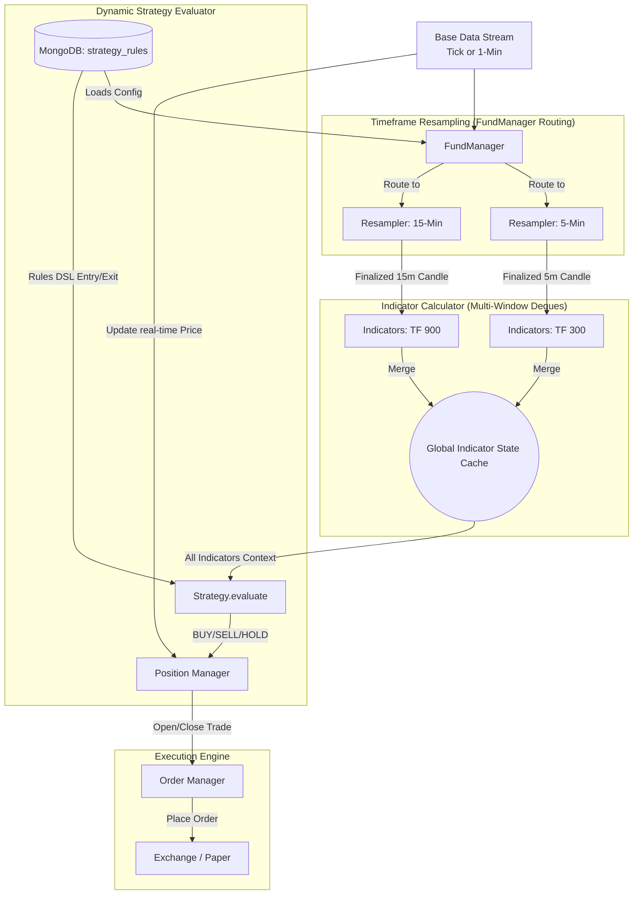
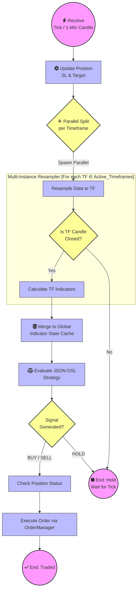

# Trade Engine Workflow (Multi-Timeframe Architecture - MTFA)

This document outlines the flow of data and execution within the Trade Bot V2 engine, which has been refactored to natively support Multi-Timeframe Analysis (MTFA) based on JSON-DSL strategy rules from the database.

## 1. Workflow Diagram (MTFA)

The engine has shifted from a linear "Single Candle -> Strategy" pipeline to a concurrent "Multi-Candle -> Synchronized Strategy Evaluation" model.

### High-Level Data Flow

### Business Process Model and Notation (BPMN)

This detailed process model illustrates the exact sequencing logic and the parallel multiple-instance execution spawned by the `FundManager` upon receiving a new market data tick.

## 2. Component Roles

### 2.1. Market Data Source
- **Live**: XTS WebSocket (`1501` Ticks or BarData).
- **Simulation**: `SocketDataService` (via `SocketDataProvider`) simulating real-time streams locally.

### 2.2. Fund Manager (`packages/tradeflow/fund_manager.py`)
- The **Active Orchestrator Engine**.
- Initializes sub-components based on a `strategy_rules` DB document.
- **Tick Normalization**: Natively handles both raw ticks (price-only) and base 1-minute candles. If a raw tick is received, it automatically populates standard OHLC keys (`o`, `h`, `l`, `c`) to ensure compatibility with downstream resamplers and ML strategy windows.
- Dynamically spawns `CandleResampler` instances for every unique timeframe required by the active strategy indicators.
- Routes incoming ticks/base candles into all active resamplers.
- Maintains a `Global Indicator State Cache` merging finalized indicators across timeframes.
- **Derivative Resolution**: When trading options, evaluating conditions based on Spot Data (e.g. NIFTY Nifty 50), the engine will automatically resolve the correct Option Strike (ITM/ATM/OTM) or Futures contract from MongoDB's `instrument_master` upon signal confirmation.

### 2.3. Candle Resampler (`packages/tradeflow/candle_resampler.py`)
- Aggregates raw ticks or base 1-minute candles into higher timeframes (e.g., 5-minute candles).
- Emits a "Finalized Candle" event specifically tagged with its timeframe when a candle closes.

### 2.4. Strategy Engine (`packages/tradeflow/strategy.py` & `indicator_calculator.py`)
- **Indicator Calculator**: 
  - Maintains separate memory `deques` for each timeframe.
  - Dynamically calculates specific technical indicators (RSI, EMA, etc.) using `Polars` based entirely on the `indicators` array in the `strategy_rules`.
- **Strategy Logic (`strategy.py`)**: 
  - A stateless engine.
  - Recursively parses the JSON-DSL condition trees (e.g., `operator: "AND"`, `type: "crossover"`) defined in the database.
  - Evaluates the global indicator state to generate `BUY`, `SELL`, or `HOLD` signals.

### 2.5. Execution Engine (`packages/tradeflow/position_manager.py` & `order_manager.py`)
- **Position Manager**: 
    - Tracks current trade orientation (Flat, Long, Short).
    - Checks incoming Strategy Signals against the current position.
    - Operates iteratively: updates internal **Stop Loss** and **Targets** conditions *on every tick* directly from the data stream.
    - **Multiple Targets**: Exits specific quantity sizes natively as the positions reach parameterized profit tiers.
    - **Break Even**: Automatically trails the Stop Loss to the original Entry Price after realizing the first partial target.
    - **Trailing SL**: Supports trailing the stop-loss behind the highest/lowest trade price for unbounded captures.
- **Order Manager**: 
    - Executes the actual trade payload.
    - Default: `PaperTradingOrderManager` for simulations.

## 3. Testing Process

Due to the complex routing of the MTFA engine, rigorous testing is mandated before touching the UI or Backtesting CLIs.

- **Unit Tests (`tests/test_indicator_calculator.py`)**: Validates that independent timeframes maintain independent memory windows and calculate indicators correctly.
- **Unit Tests (`tests/test_strategy.py`)**: Validates the JSON-DSL parser handles complex nested AND/OR and inverted primitive conditions cleanly.
- **Integration Tests (`tests/test_strategy_integration.py`)**: Spans the entire pipeline. A mock MTFA rule is fed into `FundManager`, which reads 1-minute historical data streams natively or via local `SocketDataService`, resamples to 5-min internally, cross-verifies logic, and guarantees generated signals are identical regardless of the ingestion method.
