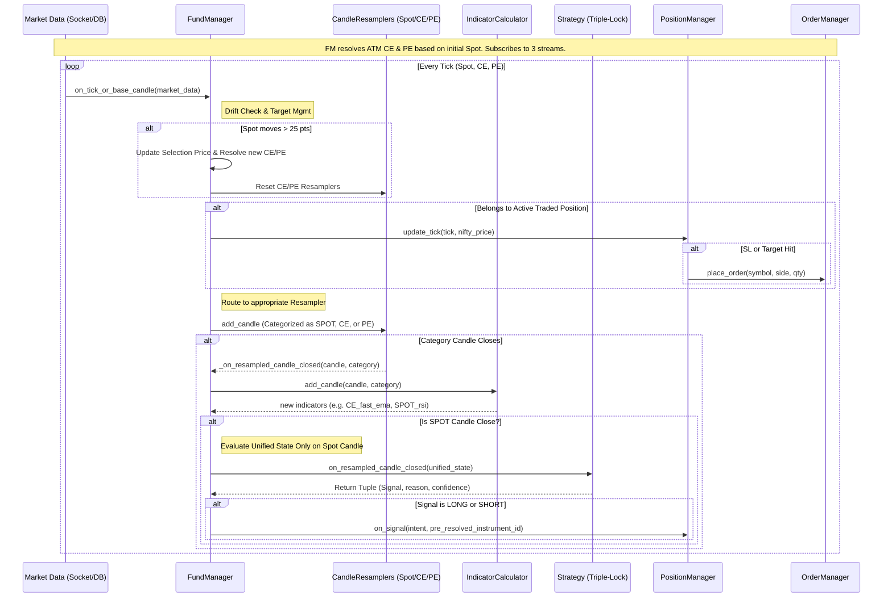

# TradeFlow Architecture Diagrams

This document provides two complementary views of the TradeFlow system:
1. **Structural Flow (Swimlane)**: Shows organizational separation and component roles.
2. **Temporal Flow (Sequence)**: Shows the timing and order of events during execution.

## 1. Structural View (Swimlane Diagram)

This diagram groups components into functional layers. It highlights the dual-path processing: high-frequency tick monitoring and low-frequency candle-close strategy logic.

```mermaid
flowchart TB
    subgraph DATA_LAYER ["Market Data Layer"]
        MD_SPOT[Tick Stream: Nifty Spot]
        MD_CE[Tick Stream: ATM CE]
        MD_PE[Tick Stream: ATM PE]
    end

    subgraph ORCHESTRATOR ["Orchestration (FundManager)"]
        FM[on_tick_or_base_candle]
        DRIFT{Check Drift > 25?}
        RESOLVE[Resolve new ATM CE/PE]
        RS_SPOT[CandleResampler: SPOT]
        RS_CE[CandleResampler: CE]
        RS_PE[CandleResampler: PE]
        IC[IndicatorCalculator]
    end

    subgraph LOGIC ["Strategy Logic (Triple-Lock)"]
        ST[Rule Engine Evaluation]
        TL{Triple-Lock Match?}
    end

    subgraph EXECUTION ["Execution (PositionManager/OrderManager)"]
        PM[update_tick monitoring]
        SL[Target / SL Check]
        OS[on_signal]
        OP[_open_position]
        CP[_close_position]
        OM[OrderManager]
    end

    %% Data Ingestion and Drift Routing
    MD_SPOT -->|Every Tick| FM
    MD_CE -->|Every Tick| FM
    MD_PE -->|Every Tick| FM
    
    FM --> DRIFT
    DRIFT -- Yes --> RESOLVE
    RESOLVE -->|Subscription Maps| FM
    
    %% Immediate SL hit mapping
    FM -.->|Immediate Tick Update| PM
    PM -.-> SL
    SL -.->|Target/SL Hit| CP

    %% Resampling
    FM -->|Spot Data| RS_SPOT
    FM -->|CE Data| RS_CE
    FM -->|PE Data| RS_PE
    
    %% Indicator Generation
    RS_SPOT -->|Candle Closed| IC
    RS_CE -->|Candle Closed| IC
    RS_PE -->|Candle Closed| IC
    
    %% Strategy triggers on SPOT candle close
    IC -->|Unified Ind State| ST
    
    %% Signal Logic
    ST --> TL
    TL -- PASS (evaluateSpot, evaluateInverse) -> OS
    TL -- FAIL (Conditions not met) -> FM
    TL -- Exit: Active Condition Met -> CP
    
    OS --> OP
    OP --> OM
    CP --> OM

    %% Styling with High Contrast Text
    classDef data fill:#f9f,stroke:#333,stroke-width:2px,color:#000;
    classDef orchestrator fill:#bbf,stroke:#333,stroke-width:2px,color:#000;
    classDef logic fill:#bfb,stroke:#333,stroke-width:2px,color:#000;
    classDef execution fill:#fbb,stroke:#333,stroke-width:2px,color:#000;

    class MD_SPOT,MD_CE,MD_PE data
    class FM,DRIFT,RESOLVE,RS_SPOT,RS_CE,RS_PE,IC orchestrator
    class ST,TL logic
    class PM,SL,OS,OP,CP,OM execution
```

---

## 2. Temporal View (Sequence Diagram)

This diagram focuses on the precise sequence of method calls across components during a single data iteration.



## Component Roles (Triple-Lock Paradigm)

| Component | Role | Description |
| :--- | :--- | :--- |
| **FundManager** | Orchestrator | The "Brain". Resolves CE/PE continuously based on Spot drift. Routes 3 data streams. |
| **CandleResampler** | Transformer | Configured per category (SPOT, CE, PE) rather than just timeframe. |
| **IndicatorCalculator** | Logic | Computes technical indicators per category natively. Prepends names natively (e.g. `SPOT_fast_ema`). |
| **Strategy (RuleEngine)** | Decision Maker | Implements the Triple-Lock check comparing `SPOT` vs `PE` vs `CE` via dynamic JSON DSL. |
| **PositionManager** | Execution Context | Manages active trade state, PnL, Pyramiding, Trailing SL, and multi-target exits. |
| **OrderManager** | Execution Gateway | Interfaces with the broker API (or Simulator) to execute actual trades. |
| **Market Data** | Source | Provides the raw TICK streams for all 3 monitored instruments continuously. |

